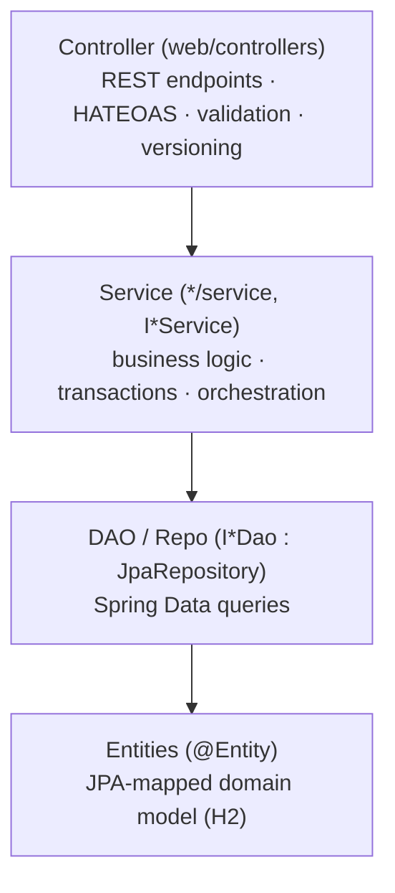
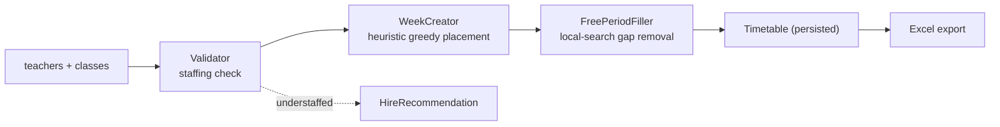
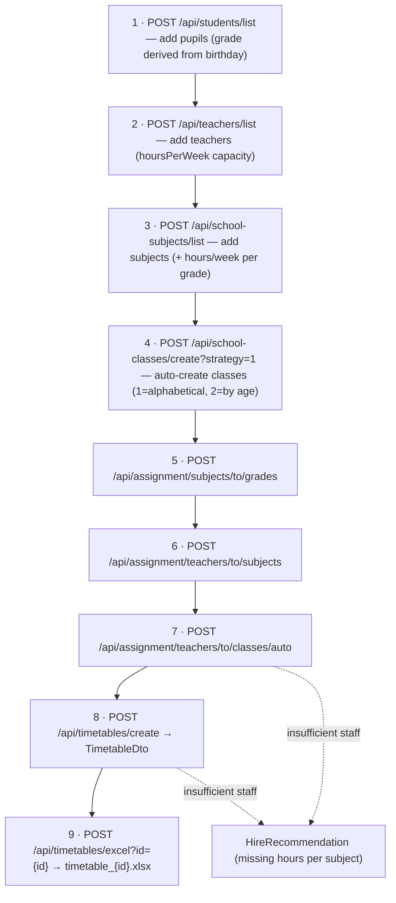

# 🗓️ School Management & Automatic Timetable Generator
 
> A **Spring Boot** REST backend that manages a primary school's students, teachers, subjects and
> classes — and, as its flagship capability, **generates a conflict-free weekly timetable
> automatically** using a custom heuristic scheduling algorithm, then exports it to Excel.

<p>
  
  
  
  
  
  
  
  
</p>

> ℹ️ It is a **backend-only** application — there is no UI. All interaction happens over a REST API
> (a ready-made Postman collection with 33 requests is included).

---

## Table of Contents

1. [Purpose](#-purpose)
2. [Main Features](#-main-features)
3. [Tech Stack](#-tech-stack)
4. [Architecture](#-architecture)
5. [The Timetable Engine](#-the-timetable-engine)
6. [End-to-End Workflow](#-end-to-end-workflow)
7. [Quickstart](#-quickstart)
8. [API Reference](#-api-reference)
9. [Configuration](#-configuration)
10. [Design Patterns](#-design-patterns)
11. [Repository Layout](#-repository-layout)

---

## 🎯 Purpose

Building a school timetable by hand is a genuinely hard combinatorial problem: every class needs all
its subject-hours placed across the week so that **no teacher and no class is ever double-booked**, day
lengths stay within limits, and — ideally — pupils have as few mid-day "free periods" (gaps) as
possible.

This project automates the full pipeline that leads up to that schedule:

1. Register the raw data (students, teachers, subjects).
2. Wire up the relationships (teachers → subjects, subjects → grades, students → classes, teachers →
   classes) — manually **or automatically**.
3. Generate a valid weekly timetable and minimise gaps.
4. When the school does not have enough qualified staff, produce a **hiring recommendation** that says
   exactly how many teacher-hours are missing per subject.
5. Export the finished timetable to a `.xlsx` file.

---

## ✨ Main Features

- **CRUD REST API** for Students, Teachers, School Subjects and School Classes (single + batch
  endpoints, bean-validated request bodies, HATEOAS links).
- **Automatic class creation** from unassigned pupils via pluggable strategies:
  - `AlphabeticalStrategy` — split each year-group into A/B/C/D classes alphabetically.
  - `BirthdayStrategy` — split by age (⚠️ currently buggy).
- **Grade derivation** — a pupil's grade (I–VIII) is computed from birth year, the configured
  school-entry age, and a per-pupil deflection offset.
- **Four assignment operations** (Student→Class, Subject→Grade, Teacher→Subject, Teacher→Class),
  dispatched through a Strategy pattern by request type.
- **Automatic teacher-to-class assignment** that respects each teacher's weekly hour capacity and
  subject qualifications.
- **Timetable generation engine** (the core) — greedy placement + local-search gap minimisation
  (detailed below).
- **Hiring recommendations** — when staffing is insufficient, a human-readable report of missing hours
  per subject, with notes about multi-subject teachers.
- **Excel export** of any generated timetable via Apache POI.
- **Centralised error handling** — `@ControllerAdvice` handlers translating domain and validation
  exceptions into structured HTTP responses.

---

## 🧰 Tech Stack

| Layer | Technology |
|---|---|
| Language | **Java 17** |
| Framework | **Spring Boot 3.1.5** (Web MVC, Data JPA, HATEOAS, Validation, DevTools) |
| Persistence | **Spring Data JPA** over **Hibernate**, **H2** file database |
| Bean mapping / boilerplate | **Project Lombok** |
| Excel export | **Apache POI** (`poi-ooxml` 5.2.5) |
| Utilities | **Google Guava** 32.1.3 |
| Validation | **Jakarta Bean Validation** (Hibernate Validator) |
| Testing | **JUnit 5 (Jupiter)**, **Mockito** 5.7.0 |
| Build | **Maven** (with `mvnw` wrapper); Spring Boot Maven Plugin + Paketo Buildpacks config |
| API tooling | Postman collection (33 saved requests) |

**Notable design choices**
- Custom **API versioning** via a required `X-API-VERSION=1` header on every endpoint.
- **HATEOAS** links on responses (`EntityModel` / `CollectionModel`).
- **DTO / Request / Entity** separation — entities are never returned directly.
- A dedicated **in-memory domain model** for the scheduling algorithm, kept separate from the JPA
  entities.

---

## 🏛 Architecture

### Layering

Classic, consistently applied layered architecture, organised **by feature** (not by technical type):



Cross-cutting building blocks: **Converters** (Entity ⇄ DTO ⇄ Request), **Factories**, **Strategies**,
**Builders**, and a set of custom **exceptions** with global `@ControllerAdvice` handlers.

### Package map

```
com.example.SchoolSystem
├── SchoolSystemApplication          # Spring Boot entry point
└── school
    ├── AppConfig                    # @ConfigurationProperties("app") tunables
    ├── person                       # PersonInformation, Address (Builder pattern), IPerson
    ├── student  / teacher           # entities, DTOs, requests, converters, services, DAOs
    ├── schoolSubject                # subject entity + hours-per-grade map
    ├── schoolClass                  # class entity, Grade/AlphabeticalGrade enums
    │   └── factory + factory/strategy   # class-creation Factory + Strategy pattern
    ├── assignments                  # request types, dispatcher service,
    │   └── strategies                    # 4 assignment Strategy implementations
    ├── lesson                       # persisted Lesson + LessonDto (record)
    ├── timetable                    # ← the core subsystem
    │   ├── validator                # pre-flight "enough teachers?" check
    │   ├── assigner                 # AutomaticTeacherToClassesAssigner
    │   ├── factory                  # TimetableFactory, WeekCreator, FreePeriodFiller
    │   ├── timetablePlainObjects    # in-memory model: Week/Day/Hour/Lesson/Teacher/Class/Subject
    │   └── converter + service      # persistence + orchestration
    ├── printer                      # Apache POI Excel export (ExcelPrinter, TimetableExcel)
    └── web                          # controllers, validators, error details, ValidList
```

---

## 🧠 The Timetable Engine

The scheduler deliberately works on a **parallel in-memory model** (`Week → Day → Hour`, plus
lightweight `TeacherTimetable` / `ClassTimetable` / `SubjectTimetable` / `LessonTimetable` objects)
that is decoupled from the JPA entities. Each `Hour` tracks the set of teachers and classes still
*available* in that slot, so a placement is valid iff both the class and the teacher are free.



**Phase 1 — Validation** (`TimetableValidatorImpl`)
Greedily assigns every required subject to a qualified teacher with spare hours. If any subject can't
be staffed, it throws `NotEnoughTeachersException` carrying a `HireRecommendation` (missing hours per
subject).

**Phase 2 — Lesson creation & placement** (`WeekCreator`)
- Explode each class's subjects into one lesson per weekly hour.
- Sort lessons by hours-per-week.
- For each lesson, pick the **day with the fewest hours for that class** that still has a slot where
  both the teacher and the class are free (a bin-packing / graph-colouring-style heuristic that spreads
  load evenly). If a lesson can't be placed within 5 days, throw
  `SchoolClassHasToManyLessonsPerWeekException`.

**Phase 3 — Free-period minimisation** (`FreePeriodFiller`)
Iterates up to `app.max-attempts-to-fill-free-periods` times, running two local-search heuristics that
try to pull "edge" lessons inward to close mid-day gaps — first using the class's own lessons, then by
swapping lessons between classes to free up the right teacher.

**Phase 4 — Persist & export**
The in-memory `Week` is flattened into persisted `Lesson` rows (`Timetable` entity); `ExcelPrinter`
renders one grid per class into `timetable_{id}.xlsx`.

---

## 🔄 End-to-End Workflow

The intended "happy path" for producing a timetable:



If step 7 or 8 cannot be satisfied with the current staff, the API returns a **`HireRecommendation`**
describing the missing teacher-hours per subject instead of a timetable.

---

## 🚀 Quickstart

### Prerequisites
- JDK 17+
- No local Maven needed — use the bundled wrapper.

### Build & run
```bash
# from the project root
./mvnw clean package        # Windows: mvnw.cmd clean package
./mvnw spring-boot:run      # starts on http://localhost:8080
```

The app uses an H2 **file** database at `~/test2` (see `application.properties`).

> ⚠️ **Heads-up:** `spring.jpa.hibernate.ddl-auto=create` means the schema is **dropped and recreated
> on every startup** — all data is wiped each run. This is a demo/dev setting.

### Talking to the API
Every request must include the header:
```
X-API-VERSION: 1
```
Import `postman_collection_to_communicate_with_api/School.postman_collection.json` into Postman for
ready-to-run examples, or use cURL:

```bash
curl -X POST http://localhost:8080/api/students \
  -H "Content-Type: application/json" \
  -H "X-API-VERSION: 1" \
  -d '{
        "firstName":"Jan","lastName":"Kowalski","IDNumber":"123",
        "birthday":"21-03-2016","phone":"111 222 333",
        "email":"jan@example.com","city":"Warszawa","street":"Main",
        "houseNumber":1,"flatNumber":7,"gradeToBirthdayDeflection":0
      }'
```

---

## 📡 API Reference

All endpoints require the `X-API-VERSION: 1` header. Batch variants accept a JSON array via `/list`.

| Area | Method & Endpoint | Description |
|---|---|---|
| **Students** | `POST /api/students` · `/list` | Add one / many pupils |
| | `GET /api/students` · `/{id}` | List all / fetch one |
| | `PUT /api/students/{id}` · `DELETE /api/students/{id}` | Update / delete |
| **Teachers** | `POST /api/teachers` · `/list` | Add one / many teachers |
| | `GET /api/teachers/all` · `/{id}` | List all / fetch one |
| | `PUT /api/teachers/{id}` · `DELETE /api/teachers/{id}` | Update / delete |
| **Subjects** | `POST /api/school-subjects` · `/list` | Add one / many subjects (+ hours per grade) |
| | `GET /api/school-subjects` · `/{id}` · `PUT` · `DELETE /{id}` | Read / update / delete |
| **Classes** | `POST /api/school-classes/create?strategy={1\|2}` | Auto-create classes (1 = alphabetical, 2 = by age) |
| **Assignments** | `POST /api/assignment/students/to/classes` | Assign students → classes |
| | `POST /api/assignment/subjects/to/grades` | Assign subjects → grades |
| | `POST /api/assignment/teachers/to/subjects` | Assign teachers → subjects |
| | `POST /api/assignment/teachers/to/classes` · `/auto` | Assign teachers → classes (manual / automatic) |
| **Timetables** | `POST /api/timetables/create` | Run the scheduling engine → `TimetableDto` (or `HireRecommendation`) |
| | `POST /api/timetables/excel?id={id}` | Export a saved timetable to `timetable_{id}.xlsx` |
| | `GET /api/timetables/{id}` | Fetch a saved timetable |

---

## ⚙️ Configuration

`application.properties`:

| Property | Default | Meaning |
|---|---|---|
| `app.first-student-year-age` | 7 | Age at which a child enters grade I |
| `app.max-students-per-class` | 30 | Capacity ceiling per class |
| `app.max-hours-per-day` | 10 | Slots per school day (timetable grid height) |
| `app.max-attempts-to-fill-free-periods` | 10 | Local-search iteration cap |
| `app.date-time-format-pattern` | `dd-MM-yyyy` | Birthday parse format |
| `spring.jpa.hibernate.ddl-auto` | `create` | ⚠️ recreates schema each startup |

---

## 🧩 Design Patterns

| Pattern | Where |
|---|---|
| **Strategy** | `SchoolClassCreatingStrategy` (Alphabetical/Birthday); `IAssignmentStrategy` (4 assignment types) |
| **Factory** | `ISchoolClassFactory`, `ITimetableFactory` |
| **Builder** | `PersonInformation.Builder`, `Address.Builder` |
| **DTO / Converter** | every feature (`*Converter`, `*Dto`, `*Request`) |
| **Adapter model** | timetable "plain objects" decoupling the algorithm from JPA |
| **Global handler** | `@ControllerAdvice` exception handlers |

---

## 📁 Repository Layout

```
school_system-main/
├── src/main/java/...      # 108 Java source files, ~5,600 LOC
├── src/main/resources/    # application.properties, MANIFEST.MF
├── src/test/java/...      # 5 test files, ~800 LOC (Student/Teacher services + 1 controller)
├── postman_collection.../ # 33 example API requests
├── pom.xml                # Maven build
├── mvnw / mvnw.cmd        # Maven wrapper
├── out/artifacts/...jar   # ⚠️ 72 MB pre-built jar committed to the repo
└── timetable_1.xlsx       # ⚠️ a generated export committed to the repo
```
